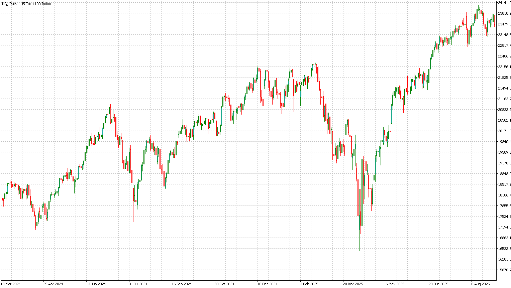

# Price Data Downloader and Converter
Download and convert price data from Yahoo Finance into Metatrader 5 daily bar format

### Description
This Python script, "Forex Data Downloader and Converter," automates the process of acquiring and preparing financial data for both general analysis and specific trading platforms like MetaTrader 5 (MT5). It uses the yfinance library to download daily foreign exchange (forex) data from Yahoo Finance.

After a successful download, the script performs three key actions:
* Saves Data: It saves the raw, downloaded data into a standard CSV file for general use.
* Formats for MT5: It restructures the data to meet the specific format requirements of the MT5 platform, including adding 'Time' and 'Spread' columns, and reorders the columns to 'Date', 'Time', 'Open', 'High', 'Low', 'Close', 'Volume', 'Spread'. This MT5-compatible data is then saved to a separate CSV file.
* Visualizes Data: It generates and displays a time-series plot of the asset's daily closing prices using the matplotlib library, providing a visual representation of historical price movements.

This tool is useful for traders and analysts who need to quickly obtain and format historical data for backtesting, technical analysis, or other quantitative tasks.

Code: [here](https://github.com/handiko/Price-Data-Downloader-and-Converter/blob/main/JupyterNotebook/Download%20Data%20From%20Yahoo%20Finance.ipynb)

### How to Use
Simply call **download_and_process_data(ticker_symbol: str, start_date: str = '2010-01-01')** with the arguments as required:
```python
"""
    Downloads forex data, saves it to CSVs, and plots the closing price.

    Args:
        ticker_symbol (str): The ticker symbol for the forex pair (e.g., 'EURUSD=X').
        start_date (str): The start date for the data download in 'YYYY-MM-DD' format.
    """
```

---

### Result Example (Nasdaq)

